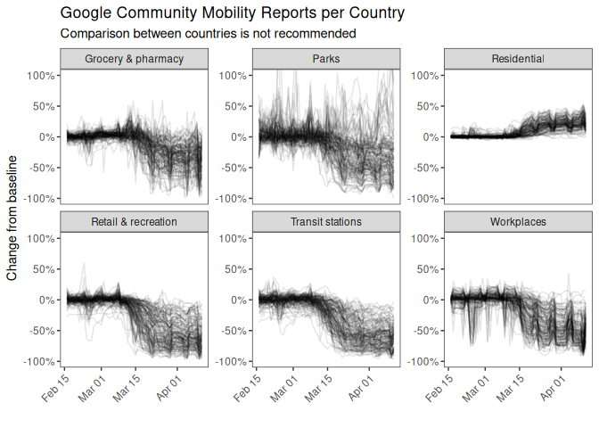
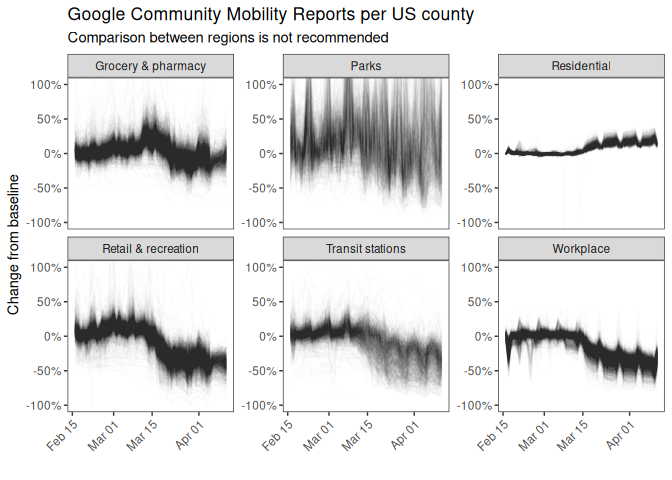

<!-- README.md is generated from README.Rmd. Please edit that file -->

# Google Location data during the Covid-19 period

Archive of data extracted from Google’s [Community Mobility
Reports](https://www.google.com/covid19/mobility/). All countries are
included.

Last updated on the 10th of April 2020, with data up to the 5th of April
2020.

## Data Quality

The onus is on you to check against the originnal PDF files, but this
should be okay to use. Previous problems have been fixed. It has been
checked against similar work by the [Office for National Statistics Data
Science
Campus](https://github.com/datasciencecampus/mobility-report-data-extractor).

## Countries by category

Illustration of the data only. Google recommends against comparing
changes between countries or regions.

> Location accuracy and the understanding of categorized places varies
> from region to region, so we don’t recommend using this data to
> compare changes between countries, or between regions with different
> characteristics (e.g. rural versus urban areas).

## Data download

For now, download a dated file of
[countries](https://raw.githubusercontent.com/nacnudus/google-location-coronavirus/master/2020-03-29-country.tsv)
or [United States
counties](https://raw.githubusercontent.com/nacnudus/google-location-coronavirus/master/2020-03-29-region.tsv).
They are tab-separated.

## Method

Based on similar work by the [Office for National Statistics Data
Science
Campus](https://github.com/datasciencecampus/mobility-report-data-extractor).

1.  Convert the PDF files to SVG format, and extract the trend lines.
2.  Extract text from the PDF.
3.  Pair up the text with the trends.

The differences are:

1.  All countries are included.
2.  Using R, instead of Python
3.  Scripting pdf-\>svg file conversion with
    [`pdf2svg`](https://github.com/dawbarton/pdf2svg), rather than doing
    it manually.

## Related work

  - <https://github.com/mattkerlogue/google-covid-mobility-scrape>
  - <https://github.com/reconhub/covid19hub/issues/2>
  - <https://github.com/pastelsky/covid-19-mobility-tracker>
  - <https://github.com/vitorbaptista/google-covid19-mobility-reports>
